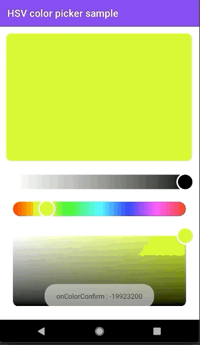

# HSVPicker

[](https://maven-badges.herokuapp.com/maven-central/com.github.lakelab/HSVPicker)

HSVPicker is an easy and highly customizable HSV picker library for Android.

- It's an all separated and highly customizable color picker library for Hue, Saturation, Value, and Alpha.
- Resizable slider and panel.
- There are NO dependencies with any android framework's view (100% Custom view)




## Download

You can use Gradle :
```gradle
repositories {
    mavenCentral()
}

dependencies {
   implementation 'com.github.lakelab:HSVPicker:1.0.0'
}
```

Or Maven:

```xml
<dependency>
  <groupId>com.lakelab</groupId>
  <artifactId>HSVPicker</artifactId>
  <version>1.0.0</version>
  <type>pom</type>
</dependency>
```

## How do I use HSVPicker?

### Basic usage

1. Arrange the pickers on your activity or fragment 
```xml
    <com.github.lakelab.hsvpicker.AlphaSlider
        android:id="@+id/alpha_slider"
        android:layout_width="match_parent"
        android:layout_height="wrap_content"
        android:padding="10dp"
        />

    <com.github.lakelab.hsvpicker.HueSlider
        android:id="@+id/hue_slider"
        android:layout_width="match_parent"
        android:layout_height="wrap_content"
        android:padding="10dp"
        />

    <com.github.lakelab.hsvpicker.SatValPanel
        android:id="@+id/sat_val_panel"
        android:layout_width="match_parent"
        android:layout_height="200dp"
        android:padding="10dp"
        />

```

2. Connect with the ColorMediator
```kotlin
class MainActivity : AppCompatActivity(), ColorMediator.OnColorChangedListener {

    private val colorMediator = ColorMediator()
    private var samplePanel: MaterialCardView? = null
    override fun onCreate(savedInstanceState: Bundle?) {
        super.onCreate(savedInstanceState)
        setContentView(R.layout.activity_main)
        colorMediator.alphaSlider = findViewById(R.id.alpha_slider)
        colorMediator.satValPanel = findViewById(R.id.sat_val_panel)
        colorMediator.hueSlider = findViewById(R.id.hue_slider)
        colorMediator.setOnColorChangedListener(this)
        samplePanel = findViewById(R.id.sample_panel)
        samplePanel?.setCardBackgroundColor(colorMediator.currentColor)
    }

    override fun onDestroy() {
        super.onDestroy()
        colorMediator.detach()
    }

    override fun onColorChanged(color: Int) {
        samplePanel?.setCardBackgroundColor(color)
    }

    override fun onColorConfirmed(color: Int) {
		// It will be called when you stop the gesture.
        Toast.makeText(this, "onColorConfirm : $color", Toast.LENGTH_LONG).show()
    }
}
```
### Options
#### For XML
```xml
<!-- Common attributes -->
app:thumbColor="#f0f0f0"
app:thumbRadius="10dp"
app:thumbStrokeColor="#000000"
app:thumbStrokeWidth="3dp"

<!-- Slider attribute -->
app:sliderWidth="30dp"
app:sliderOrientation = "horizontal"
app:sliderCornerRadius = "2dp"

<!-- Panel attribute -->
app:panelCornerRadius = "2dp"
```

#### For code
```kotlin
val slider : AlphaSlider = findViewById(R.id.alpha_slider)
slider.thumbRadius = 13f
slider.thumbColor = Color.parseColor("#ffffff")
slider.thumbStrokeColor = Color.parseColor("#ffffff")
slider.thumbStrokeWidth = 13f
slider.sliderWidth = 30f
slider.sliderOrientation = "horizontal"
slider.sliderCornerRadius = 2f

val panel : SatValPanel = findViewById(R.id.sat_val_panel)
panel.panelCornerRadius = 2f
```

#### Attributes

##### Common attributes

|  Attribute Name  | Description        |                    Default Value                     |
| :--------------: | :----------------: | :--------------------------------------------------: |
|    thumbColor    | Thumb color        | null<br />(It will be changed to the selected color) |
| thumbStrokeColor | Thumb stroke color |                       #ffffff                        |
|   thumbRadius    | Thumb radius size  |                         15dp                         |
| thumbStrokeWidth | Thumb stroke with  |                         2sp                          |

##### Slider attributes

|     Attribute Name      | Description              | Default Value |
| :--------------------:  | :----------------------: | :-----------: |
|    sliderWidth          | Width of slider          |     30dp      |
|    sliderOrientation    | Orientation of slider    |  horizontal   |
|    sliderCornerRadius   | Radius of slider corners |     21dp      |

##### Panel attributes

|     Attribute Name      | Description             | Default Value |
| :--------------------:  | :---------------------: | :-----------: |
|    panelCornerRadius    | Radius of panel corners |     21dp      |

### Sample Usage

You could check the sample code in [this app module](app)

## Contribution 

Feel free to report any issues or any contributions :).\
Any kind of contributions is welcome!

## Licence

```
Copyright 2021 Lake Lab

Licensed under the Apache License, Version 2.0 (the "License");
you may not use this file except in compliance with the License.
You may obtain a copy of the License at

    http://www.apache.org/licenses/LICENSE-2.0

Unless required by applicable law or agreed to in writing, software
distributed under the License is distributed on an "AS IS" BASIS,
WITHOUT WARRANTIES OR CONDITIONS OF ANY KIND, either express or implied.
See the License for the specific language governing permissions and
limitations under the License.
```